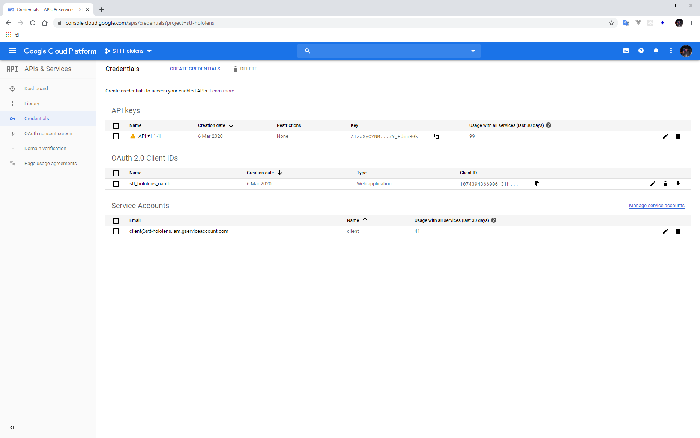
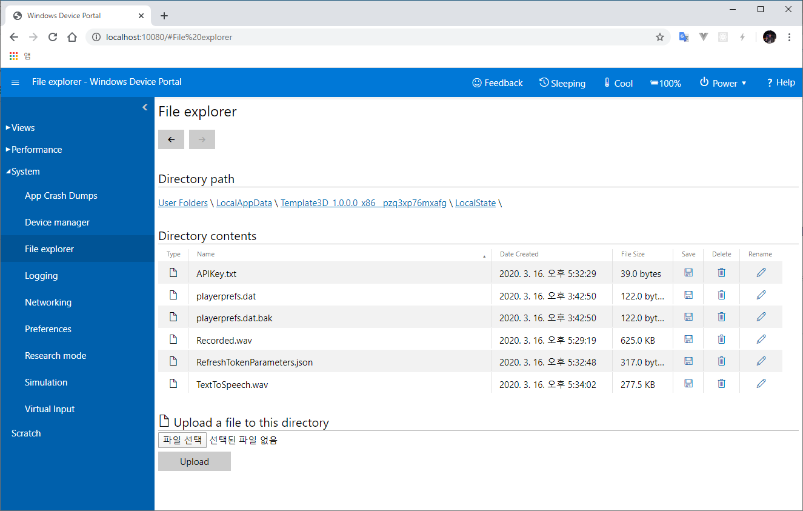
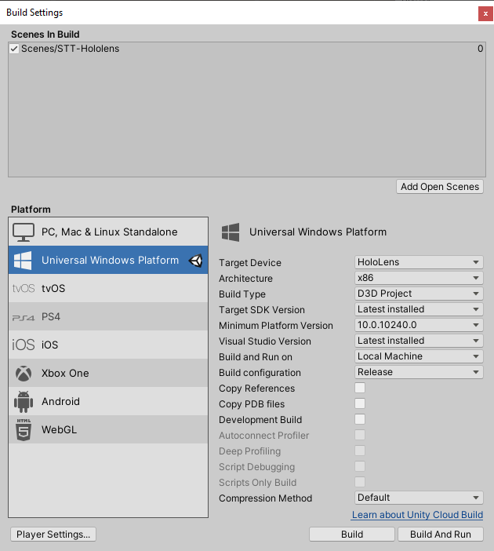
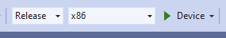

# STT-Hololens

Unity translation app using Google Cloud

- Speech-to-Text: get result text
- Translate text: get translated english text
- Text-to-Speech: get english speech

on Hololens

## Demo video

[](https://www.youtube.com/watch?v=i8JYddLN47I "HoloLens Speech to Text, Tranlate, Text to Speech")

## Developement environment

### Tools

- Unity 2019.3.5f1
  - Add modules `Universal Windows Platform Build Support`, 2.1GB
  - Pacakges
    - Windows Mixed Reality 4.2.1
    - [Microsoft Mixed Reality Toolkit v2.3.0](https://github.com/Microsoft/MixedRealityToolkit-Unity/releases)
- Visual Studio Community 2019 16.4.5
  - Add workloads `Game development with Unity` (Unity)
  - Add workloads `Desktop development with C++` (UWP)
  - Add workloads `Universal Windows Platform development` (UWP)

### Device

- Hololens OS build 10.0.17763.1039

## Preference setup

### Google Cloud Platform account

- Sign in google cloud platform
- Create project
  - Any name you want.
- APIs & Services > Credentials > API Keys
  - Create API Key
- APIs & Services > Credentials > OAuth Client ID
  - Create Client ID
- All credentials create is done. You can see credentials page like this.


### Locate file directory

- Unity app can read/write directory is `Application.persistentDataPath`
- [https://docs.unity3d.com/ScriptReference/Application-persistentDataPath.html](https://docs.unity3d.com/ScriptReference/Application-persistentDataPath.html)
  - Unity Editor: %AppData%/LocalLow/\<CompanyName>/\<AppName>
  - Hololens: User Folders/LocalAppData/\<AppName>/LocalState
    - You can't see directory in Explorer, Connect to `Device Portal` and Menu > System > File explorer
    - 

### API key

- Create `APIKey.txt` file for Text to Speech and Speech to Text
- Copy google api key string to file and paste it to in text editor

### Access token

#### Get refresh token first

- To get access token, you can use OAuth2.0 request to google auth server.
  - Request to [https://accounts.google.com/o/oauth2/v2/auth](https://accounts.google.com/o/oauth2/v2/auth)
  - Reference issue: [OAuth2.0 obtaining access tokens](https://github.com/jongfeelkim-VIRNECT/STT-Hololens/issues/22)
- Google login -> move to redirectURL -> get code value from GET method parameter
- Exchange authorization code for refresh and access tokens
  - Request to [https://oauth2.googleapis.com/token](https://oauth2.googleapis.com/token)
- Finally, you get access token and refresh token.

#### Create RefreshTokenParameters.json

- Create `RefreshTokenParameters.json` file for translate
- Copy below json text and replace your appropriate values.

``` json
{
    "client_id" : "<YourClientID>",
    "client_secret" : "<YourClientSecret>",
    "grant_type" : "refresh_token",
    "refresh_token" : "<YourRefreshToken>"
}
```

## Build UWP project in Unity

- Open Unity project scene from Assets/Scenes/STT_Hololens.scene
- Open Build Settigs popup `Ctrl+Shift+B` or `File > BuildSettings...`
- Checkout build options
  - 
- Click `Build` button
- Select exist folder to UWP project target.

## Build Hololens app in UWP project

- Open Visual Studio Solution file from <`BuildFromUnityFolder`>/STT-Hololens.sln
- Checkout build options
  - 
  - Solution configurations: Release or Master
  - Solution platforms: x86
  - Build to target: Device(hololens)
- Click Deivce(Debug run) button

## Reference Google Cloud APIs

- [https://cloud.google.com/speech-to-text/docs](https://cloud.google.com/speech-to-text/docs)
- [https://cloud.google.com/translate/docs](https://cloud.google.com/translate/docs)
- [https://cloud.google.com/text-to-speech/docs](https://cloud.google.com/translate/docs)
